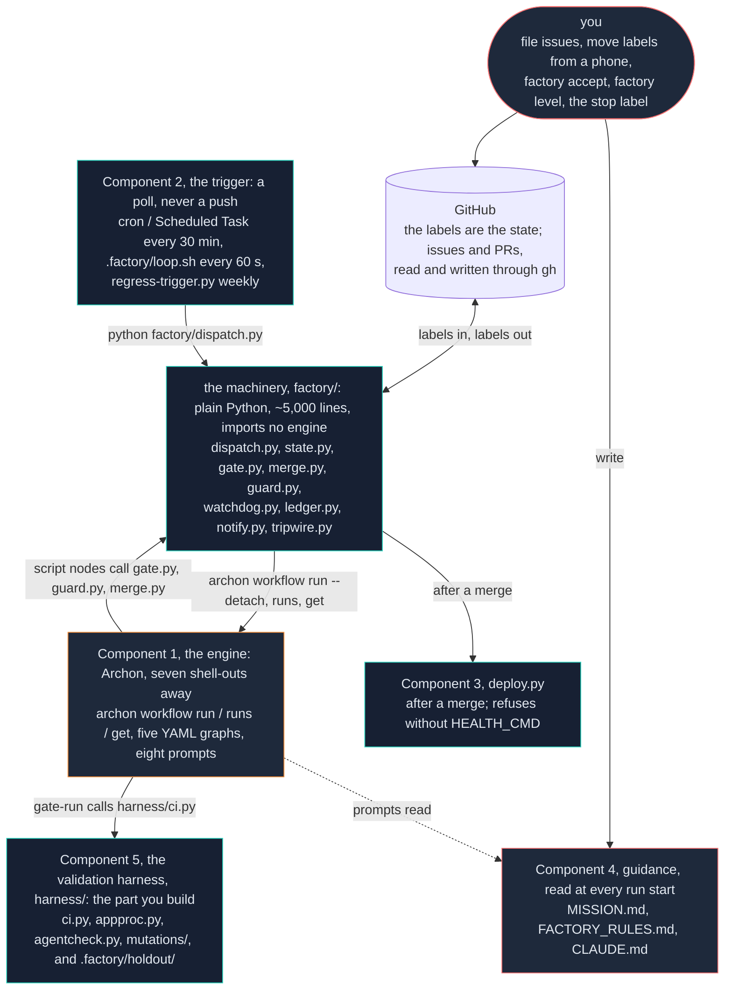
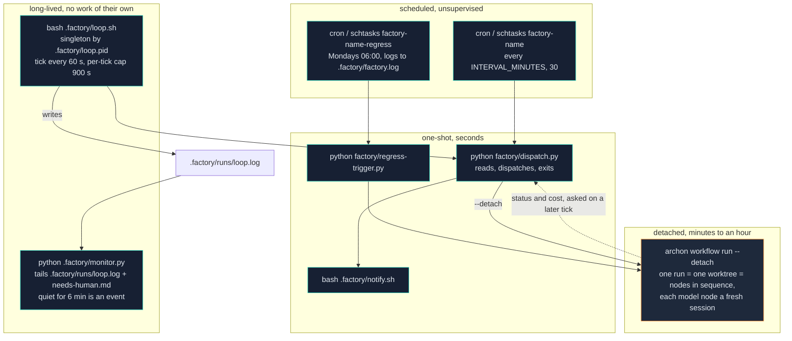
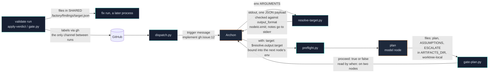

# Component map

Every file in this repo: what it does, whether it is enforced in code or by a prompt,
and whether it is tied to Archon or portable to another engine.

> **Tracks:** the whole of `bin/` and `template/`. After `git pull`, diff this against
> `git log --stat` on those directories.

---

## The five components

Cole's framing. Everything in the repo is one of these.

| # | Component | This repo's version | Yours must have |
|---|---|---|---|
| 1 | Workflow-driven repo | Archon, five workflows in `.archon/workflows/factory/` | some engine that runs ordered steps with fresh context per step |
| 2 | The trigger | `factory/dispatch.py` on a timer, `factory/regress-trigger.py` weekly | a **poll**, not a push |
| 3 | Deployment | `factory/deploy.py`, unset by default | anything that puts merged code in front of a stranger |
| 4 | Guidance layer | `MISSION.md`, `FACTORY_RULES.md`, `CLAUDE.md` | the same three, and the out-of-scope list is the load-bearing part |
| 5 | Validation harness | `harness/ci.py`, the holdout, the mutation set | this is the one nobody can write for you |

Component 5 is the whole build. Components 1–4 ship done.

### The layers, and where the engine boundary is

Read it top to bottom as "who calls whom": each layer only calls the one below it.
The engine (orange) sits in the middle, and it is the only layer that needs
replacing to move off Archon. The three files on the right are read by every run and
written only by you.



---

## What is enforced in code, and what is a prompt

A gate written as an instruction in a prompt is a suggestion with good manners. This
is the line.

### Code — a model cannot argue past these

| File | Enforces | Fails how |
|---|---|---|
| `factory/gate.py` | every required marker present, counts ≥ ratchet floor, mutations all caught, **overrides the judge when raw output disagrees** | exit 1 = escalate, 2 = wrong state, 3 = verdict recorded, no merge |
| `factory/merge.py` | re-checks the guard, the merge base, and GitHub's own merge state before touching a branch | exit 1 = needs a human, 2 = already requeued |
| `factory/guard.py` | protected paths, 500 production lines, 1500 total, 12 files | **fails closed** — exit 2 when the diff cannot be computed |
| `factory/state.py` | the transition table. `needs-human` is terminal: its allowed-destination set is empty | `IllegalTransition` |
| `factory/watchdog.py` | seven detectors over the ledger | writes `.factory/STOP` and notifies |
| `factory/tripwire.py` | no builder artifact reached the validator | non-zero, loudly |
| `factory/dispatch.py:59` | the autonomy dial per action | logs `HOLD` and does not dispatch |
| `harness/ci.py` | the rung ladder, and that zero tests is not a pass | exit non-zero, `GATE_FAILED: <rung>` |
| `.factory/locks/floor.json` | the ratchet — and it is protected, so lowering it is a human commit | gate blocker |
| `.factory/holdout/` | denied to every builder node for **read**, not just write | the node cannot open it |

### Prompts — yours to rewrite, and Cole says so

| File | Lines | Job |
|---|---|---|
| `implement/commands/prime.md` | 67 | orient in the codebase, read-only |
| `implement/commands/plan.md` | 169 | **the personalisation layer.** The premium slot. Explicitly "replace it with your own planning step". |
| `implement/commands/implement.md` | 115 | work the plan task by task |
| `implement/commands/review.md` | 87 | read your own diff before anyone else does |
| `validate/commands/judge.md` | 122 | does this diff solve the issue as filed? |
| `triage/commands/triage.md` | 118 | in scope, deferred, out of scope, or human? |
| `fix/commands/fix.md` | 106 | address the findings and nothing else |
| `regress/commands/diagnose.md` | 79 | what broke on main, with evidence |

Ten Claude Code skills in `template/.claude/skills/` let you drive the same loop by
hand without the engine: `factory-prime`, `-plan`, `-implement`, `-review`, `-judge`,
`-triage`, `-fix`, plus `-e2e` and `-holdout` (drive the journeys / the hidden
scenarios) and `-setup` (the install interview). See
[Portability](#portability-what-archon-supplies) below for what they cannot give you.

---

## Every file

### `bin/` — the installer, in this repo only

| File | Lines | What it does |
|---|---|---|
| `factory.py` | 886 | The CLI. `init`, `doctor`, `tick`, `run`, `accept`, `level`, `arm`/`disarm`, `halt`/`resume`, `status`. `init` copies the template in, creates the GitHub labels, and installs Archon if absent. |
| `sync-to.py` | 172 | Push template fixes into a repo that already installed. Compares content and copies only what differs — because on Git Bash for Windows, `cp -r src/. dst/` reports success and leaves the destination untouched. Two rounds of a real fix were lost to that. |
| `audit.py` | 928 | Audits the **machinery**, not your repo. `doctor` asks "is this repository set up correctly?"; this asks "is the machinery underneath it still sound?" A correctly configured repo running broken machinery passes every check the doctor has. |
| `selfcheck-mutations.py` | 183 | Mutation-tests the self-test. Injects defects into a throwaway copy of the template and requires `_selftest.py` to go red. |

### `template/factory/` — the runtime

Copied to `factory/` in your repo.

| File | Lines | What it does |
|---|---|---|
| `config.py` | 462 | **The file you edit.** Every project-specific path, command, marker, cap and model tier. Every setting overridable from the environment under the same name. Also resolves `ROOT` vs `SHARED` and detects the base branch from `origin/HEAD` rather than assuming `main`. |
| `state.py` | 752 | The state machine over GitHub labels. `TRANSITIONS`, `next_action()`, `set_state()`, `comment()`, `stop_requested()`, `init_labels()`. |
| `dispatch.py` | 906 | The tick. Stop button → watchdog → reconcile → dial → concurrency → priority order. Consults no model. |
| `gate.py` | 682 | The structural gate. Decision 1 of 2 that is code. |
| `merge.py` | 453 | The merge. Decision 2 of 2. Re-checks everything itself and raises the ratchet floor. |
| `guard.py` | 279 | Protected paths and the caps. Runs first, fails closed. |
| `watchdog.py` | 337 | Seven detectors over the ledger. `assess()` is a pure function, which is what makes them testable. |
| `ledger.py` | 168 | Append-only event log. Deliberately dumb: no analysis, no thresholds. Tolerant on read — a half-written line is skipped, because a watchdog that crashes on its own input is off exactly when things go wrong. |
| `notify.py` | 97 | The one escalation channel, defined once because three routes reach `needs-human` and three copies of a notify block is three that drift. Never fatal. |
| `trigger.py` | 255 | Installs the schedule (cron or Windows Scheduled Task). **Refuses below dial 1.** |
| `regress-trigger.py` | 85 | Dispatches the weekly regression. Separate from the dispatcher so a busy queue cannot starve the one check that looks at main. |
| `deploy.py` | 286 | Component 3. No-ops when nothing changed. **Refuses to move the pointer when `HEALTH_CMD` is empty** — a deploy with no health check is a deploy that cannot fail, and a step that cannot fail is a comment. Has `--rollback`. |
| `doctor.py` | 459 | The deterministic audit. A checklist, not a test suite. It **blocks the dial**: level 2 needs a real E2E, level 3 needs a holdout, a mutation set and a ratchet. |
| `tripwire.py` | 124 | Independence check on the validator's working directory. |
| `nodeio.py` | 122 | A node's stdout is its *value*. `note()` and stray `print()` go to stderr; `emit()` writes the JSON payload once. A single friendly line before the payload makes the output unparseable, and the error surfaces several nodes downstream. |
| `_selftest.py` | 1272 | The harness for the machinery. Fast, offline, no network. `doctor` runs it every time. Ships done — it is the one thing you do not have to build. |
| `_test_watchdog.py` | 271 | Synthetic histories for the seven detectors. |

### `template/harness/` — the validation harness

| File | Lines | What it does |
|---|---|---|
| `ci.py` | 348 | The rung ladder. The ladder is the same in every factory; every command it runs lives in the config file, not here. |
| `harness.config.json` | — | **The stack-specific half.** `static`, `unit`, `unit_count_pattern`, `driver` (`http`/`cli`/`library`), the agent command, browser install check. Ships with examples for Python, uv, Node, Bun, Go, Rust, Ruby and .NET. |
| `appproc.py` | 378 | The three drivers. Every one prints `APP_STARTED`. Split out because an HTTP-only version makes the scaffold silently useless for a CLI, a library or a batch job — the majority of software. |
| `agentcheck.py` | 412 | Runs one agent-driven rung and validates what it reports. Rejects any assertion that restates the expectation instead of the observed value. |
| `mutations/run.py` | — | Copies the repo to a temp dir per defect, applies one textual mutation to real source, runs the gate there, requires red. |
| `mutations/defects.json` | — | The defects. Protected. |
| `END-TO-END.md` | 64 | **Yours to write.** Two to five journeys in plain English. |

### `template/.factory/` — runtime state and the operator loop

| File | What it does |
|---|---|
| `loop.sh` | The dispatcher loop. One tick per interval. Singleton by PID file — three copies once ran at once and raced three merge dispatches inside three seconds. Writes `.factory/runs/loop.log`, which is the file `monitor.py` tails. |
| `monitor.py` | The operator watch, deliberately outside the factory. **Silence is not health** — it emits when the loop goes quiet, not only when something breaks. |
| `notify.sh` | Where escalations go. Writes the log first and unconditionally, then tries `FACTORY_NTFY_TOPIC` / `FACTORY_WEBHOOK_URL`, then a desktop notification, and says out loud when it could not deliver. |
| `locks/floor.json` | The ratchet. Protected. |
| `holdout/HOLDOUT.md` | **Yours to write.** Read-denied to every builder node. |

### Who is a process, and for how long

Nothing in the factory is a service. Two things run for a long time and neither of
them does any work: `loop.sh` (a `while true` with a PID file) and `monitor.py` (tails
a log). Everything that does work is a one-shot process that exits, and the runs
Archon starts outlive the tick that started them by twenty minutes or more.



Consequences worth holding: a tick started by cron has no supervisor, so
`dispatch.py` announces its own death (`DISPATCHER_FAULT`, `dispatch.py:905`) because
nobody else would. The loop and the schedule are two independent triggers for the
same tick; running both is safe because a tick is idempotent, but the per-target lock
only guards **one** dispatcher against itself, which is why `loop.sh` refuses to start
twice. And `monitor.py` watches the loop's log only; under `factory arm` alone, with
no loop running, nothing watches for silence.

### `template/` root — governance

| File | Lines | Yours? |
|---|---|---|
| `MISSION.md` | 161 | **Entirely yours.** The one file nobody can ship for you. |
| `FACTORY_RULES.md` | 315 | Ships ~95% filled in. The project-specific lines are in `<ANGLE BRACKETS>`; `doctor` reports any left. |
| `FACTORY.md` | 159 | Your factory's status page: current dial, the mutation set's rung spread, the ratchet numbers, the incident log. |
| `gitignore-additions.txt` | — | What `init` appends. |

---

## Archon, in enough detail to read the YAML

Archon (`github.com/coleam00/archon`) runs a workflow as a graph of nodes. Full docs
at `archon.diy/docs`. What follows is every field this workflow pack actually uses,
read off the five YAML files — accurate for this pack, not a complete Archon spec.

### The eight roles

Everything below traces back to eight jobs Archon does for this repo. Each one is a
row in the [portability table](#portability-what-archon-supplies) further down — this
is the same list, named plainly:

1. **Runs the workflow graphs** — the engine for Component 1: the five node graphs in
   `.archon/workflows/factory/` (`factory-implement`, `factory-validate`,
   `factory-triage`, `factory-fix`, `factory-regress`).
2. **Fresh context per node** — `context: fresh` starts a new model session per node,
   so the judge does not inherit the builder's reasoning.
3. **Tool grant and deny leash per node** — `allowed_tools` / `denied_tools` (e.g.
   `["Read(.factory/holdout/**)"]`) is what makes the holdout actually hidden from the
   builder, not just hidden by convention.
4. **A worktree per run** — the `--branch` flag isolates each lap's checkout so two
   laps cannot collide.
5. **Structured output between nodes** — `output_format` (a JSON schema) plus
   `nodeio.py` validates one node's stdout before the next node consumes it.
6. **Detached dispatch** — `--detach` returns immediately, so a 20-minute run does not
   stall the next dispatch tick.
7. **Run status and cost** — `archon workflow status` / `archon workflow get <id>
   --json` feeds the ledger's `cost_usd` and the watchdog's spend detectors.
8. **Model tier indirection plus conditionals** — `small`/`medium`/`large` insulates
   the workflows from a provider swap; `when:` / `cancel:` let a plan stop a run early.

Mechanically this is seven shell-out call sites — `dispatch.py:281,416,467,516,592`,
`regress-trigger.py:62`, `doctor.py:113` — plus `bin/factory.py`'s `init` installing
Archon if it is missing. See [Portability](#portability-what-archon-supplies) below
for what breaks without each one.

### Workflow-level fields

```yaml
name: factory-implement
description: |
  Take ONE accepted issue to an open pull request.
model: medium              # default tier for command nodes that do not override it
mutates_checkout: false    # triage only — it changes no code
inputs:
  target:
    default: ""
    description: The issue to build, as gh:issue:<n>.
returns: open-pr           # which node's output is the workflow's result
nodes: [...]
```

### Node fields

| Field | Meaning |
|---|---|
| `id` | the node's name. Other nodes reference its output as `$<id>.output.<field>` |
| `command: plan` | a **model node**. Runs `commands/plan.md` from the workflow directory. |
| `script: preflight` | a **script node**. Runs `scripts/preflight.py`. |
| `runtime: uv` | how to run a script node |
| `model: large` | tier override for this node: `small`, `medium`, `large` |
| `context: fresh` | start a new model session. Not a performance choice — see below. |
| `depends_on: [prime]` | edges in the graph |
| `when: "$gate-plan.output.proceed == true"` | conditional execution |
| `with:` | inputs bound into the node, e.g. `target: "$resolve.output.target"` |
| `output_format:` | a JSON schema. The node's stdout is parsed against it. |
| `trigger_rule: all_done` | run even if a dependency failed |
| `retry: {max_attempts: 2, on_error: all}` | retry the node |
| `timeout: 1800000` / `idle_timeout: 900000` | milliseconds |
| `allowed_tools: [Read, Glob, Grep, Write]` | the grant |
| `denied_tools: ["Read(.factory/holdout/**)"]` | the leash |
| `cancel: "reason"` | a node whose only job is to stop the run |

### Four things the YAML taught the hard way

**1. The grant is coarse; the leash is the deny.** Proven by probe, in both
directions:

```yaml
allowed_tools: ["Bash(python:*)"]   # grants NOTHING — the node has no shell
allowed_tools: [Bash]               # grants a shell
denied_tools:  ["Bash(git:*)"]      # genuinely blocks git
```

The first version scoped the grant, and the build nodes ran for weeks with no shell:
they could not run the quick gate, said so politely in prose, and exited 0.

**2. A failed producer fails the binding, and `trigger_rule: all_done` does not rescue
it.** The `apply` node in `factory-validate` binds `target` to `$resolve.output.target`
rather than `$prepare.output.target` for exactly this reason. When `prepare` died, the
one node that exists to report an infrastructure failure could not run. `resolve` is a
pure parse and effectively never fails.

**3. Constrain only what you branch on.** `gate.py` reads one field to decide anything:
`verdict`. Every enum on a field nobody branches on is a fresh chance per finding to
fail the whole run over a synonym. The judge node died five times on
`error_max_structured_output_retries` before the schema was cut back.

**4. YAML 1.1 parses bare `yes` and `no` as booleans.** So:

```yaml
enum: ["yes", "partially", "no"]     # quoted, deliberately
```

Unquoted, the enum loaded as `[True, "partially", False]` against a field declared
`type: string`. The judge produced something satisfying the contradiction and said
nothing useful. Nothing errored anywhere.

### CLI, as the dispatcher calls it

```bash
archon workflow run factory-implement --branch factory/impl-12 --detach "implement gh:issue:12"
archon workflow run factory-triage --no-worktree "triage gh:issue:12"
```

| Flag | Effect |
|---|---|
| `--branch <name>` | run in a fresh git worktree on that branch |
| `--no-worktree` | run in place (triage only) |
| `--detach` | return immediately; the dispatcher never waits |

The trigger message (`"implement gh:issue:12"`) is how the target reaches the run.
`resolve-target.py` parses it deterministically before any model sees anything, and it
arrives as an environment variable rather than substituted text — that is the
injection guard, and the reason it cannot be an inline bash one-liner.

### How data moves between nodes

Four channels, and each one is used for a different kind of thing. Nothing here is a
function call: every node is a separate process, and most are a separate model session.



| Channel | Carries | Between | Why that channel |
|---|---|---|---|
| environment variable | the trigger message, bound inputs | Archon → a node | never substituted into text a model reads: the injection guard |
| stdout JSON, `output_format` | a node's value (`proceed`, `target`, `verdict`) | node → Archon → `$id.output.field` | one payload, parsed; a stray `print()` breaks it several nodes downstream (`nodeio.py`) |
| files in `$ARTIFACTS_DIR` | the plan, `ASSUMPTIONS`, `ESCALATE`, the PR record | model node → the script after it, same run | too big for a schema; dies with the worktree |
| files in `SHARED/.factory/` | findings, counts, assumptions, the ledger | one **run** → a later run, or the tick | must outlive the worktree |
| GitHub labels and PR body | state, `Fixes #N` | everything → everything, across ticks | the one shared, visible, phone-editable store |

---

## Portability: what Archon supplies

If you rebuild this on Claude Code, or any other engine, these are the properties you
must reproduce. The middle column is what breaks without each one.

| Property | What breaks without it | How Archon gives it | Claude Code equivalent |
|---|---|---|---|
| **Fresh context per node** | the judge inherits the builder's reasoning; the whole independence argument collapses | `context: fresh` | a subagent per step (`Agent` tool), never one long session |
| **Read denial on a path** | the builder reads the holdout and optimises against it | `denied_tools: ["Read(.factory/holdout/**)"]` | `permissions.deny` in `.claude/settings.json`, or a `PreToolUse` hook that blocks the path |
| **A worktree per run** | two laps collide in one checkout; `SHARED` state is deleted with the worktree | `--branch` | `git worktree add` yourself, and get `ROOT`/`SHARED` right |
| **Structured node output** | a friendly line before the payload breaks the consumer several nodes downstream | `output_format` + `nodeio.py` | a subagent returning JSON, validated by the caller |
| **Detached dispatch** | a tick that blocks twenty minutes overlaps the next one | `--detach` | background Bash, plus a way to ask whether the run settled |
| **Run status and cost** | the watchdog's spend detectors go blind; locks can only be freed by age | `archon workflow status`, cost per run | you need some equivalent, or the ledger records `cost_usd: null` and D5 quietly weakens |
| **Model tier indirection** | a provider swap rewrites every workflow | `small`/`medium`/`large` | your own mapping |
| **Conditional / cancel nodes** | a plan that says "do not build this" still runs five more nodes | `when:`, `cancel:` | an early return in your orchestration |

### What is portable as-is

Everything in `factory/` and `harness/` is plain Python that shells out to `git` and
`gh`. **Nothing imports Archon.** The entire coupling is `config.ARCHON_BIN` plus seven
call sites that shell out to it:

| Where | Call | Job |
|---|---|---|
| `dispatch.py:281` | `archon workflow run <wf> --branch/--no-worktree --detach` | launch a lap |
| `dispatch.py:416` | `archon workflow runs --json` | find the engine's run id for the lock |
| `dispatch.py:467` | `archon workflow get <id> --json` | did the run settle? |
| `dispatch.py:516` | `archon workflow get <id> --json` | what did it cost? |
| `dispatch.py:592` | `archon workflow runs --json` | release settled locks |
| `regress-trigger.py:62` | `archon workflow run factory-regress` | the weekly run |
| `doctor.py:113` | `archon version` | is the engine installed? |

Swap the engine and you rewrite those seven plus the eight prompt files. The state
machine, the gate, the guard, the merge, the ratchet, the watchdog, the ledger and the
whole harness come across unchanged.

That is the useful shape of this codebase: **the engine is seven shell-outs, and the
safety machinery is ~5,000 lines that do not care which engine you use.**

The ten skills in `template/.claude/skills/factory-*` are the proof: the same loop,
driven by hand. What they *cannot* give you is the four properties in the table above
that need an orchestrator — fresh context enforced per step, a deny list the node
cannot lift, a worktree per run, and detached dispatch. A skill you invoke in your own
session has your session's context and your session's permissions.
