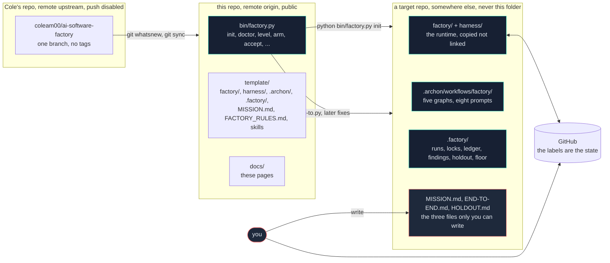

# Documentation

The AI Software Factory takes work in as a GitHub issue and ships validated code out,
with nobody reading the diff. This directory is the map.

---

## Two repos, always

Nothing here makes sense until you hold this in your head.

| | |
|---|---|
| **This repo** | The installer (`bin/`) and the template (`template/`). Nothing runs a factory here. |
| **A target repo** | Where `python bin/factory.py init` copies `template/` into. This is where laps actually run: labels, worktrees, `.factory/runs/`, locks, ledger. |

Every path in these docs is written from the target repo's root unless it starts with
`template/` or `bin/`. `template/factory/dispatch.py` in this repo becomes
`factory/dispatch.py` in yours.



---

## Start here

| Doc | What's inside | Read it when |
|---|---|---|
| [key-concepts.md](key-concepts.md) | Every term Cole uses, defined, with the file that enforces it | First. Everything else assumes these. |
| [one-lap.md](one-lap.md) | One issue traced from filed to merged, through the real code | Second. This is the doc that lets you rebuild it. |
| [component-map.md](component-map.md) | Every file, what it does, code vs prompt, Archon-coupled vs portable. Includes an Archon YAML primer. | When you start deciding what your own version keeps. |
| [study-guide.md](study-guide.md) | Reading order, exercises you can run, how to follow Cole week to week | When you want a plan rather than a reference. |
| [git-setup.html](git-setup.html) | Why this repo has two remotes, one of them write-disabled, and the two commands for staying in sync with Cole | When you touch git and want to know it is safe. Open in a browser. |

## Cole's own docs

| Doc | What's inside |
|---|---|
| [../README.md](../README.md) | What it is, how to install it, the command list, what it does not do |
| [first-hour.md](first-hour.md) | What to do after `factory init`, in order. The operator's quickstart. |
| [incidents.md](incidents.md) | Every way this has been wrong, and the mechanism added each time. 1,326 lines. It is the architecture-decision log. |
| [../template/FACTORY_RULES.md](../template/FACTORY_RULES.md) | The rulebook every workflow reads at run start. Ships ~95% filled in. |
| [../template/MISSION.md](../template/MISSION.md) | The template for the one file nobody can write for you |
| [../template/FACTORY.md](../template/FACTORY.md) | The template for your factory's own status page |

---

## Keeping these true

These four files track code that Cole changes weekly. Each one opens with a `Tracks:`
line naming the files it describes. Cole's repo is the `upstream` remote here; after
fetching it, run:

```bash
git fetch upstream
git log --oneline main..upstream/main -- template/factory/ template/harness/ bin/
```

Anything that touches a tracked file means the doc naming it needs re-reading. Doc
changes go in the same commit as the behaviour they describe.

See [study-guide.md](study-guide.md#following-cole-week-to-week) for the full pull
workflow.
