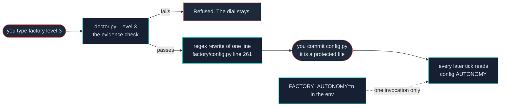
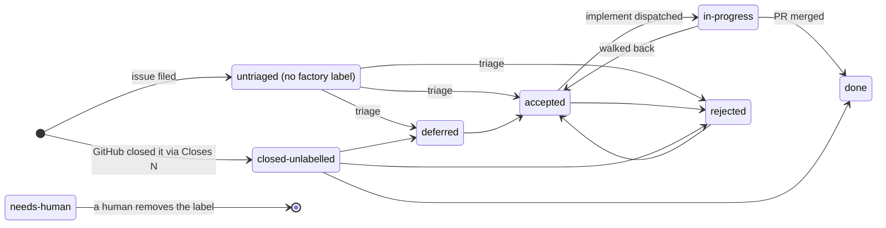
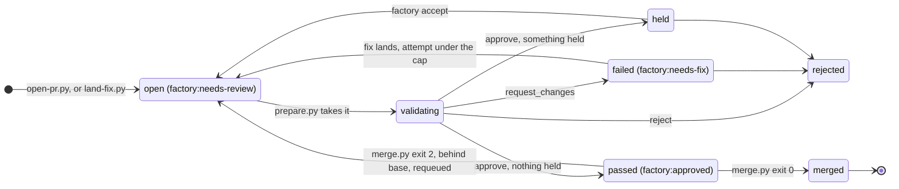
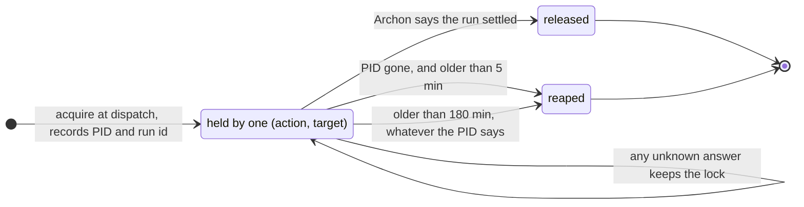
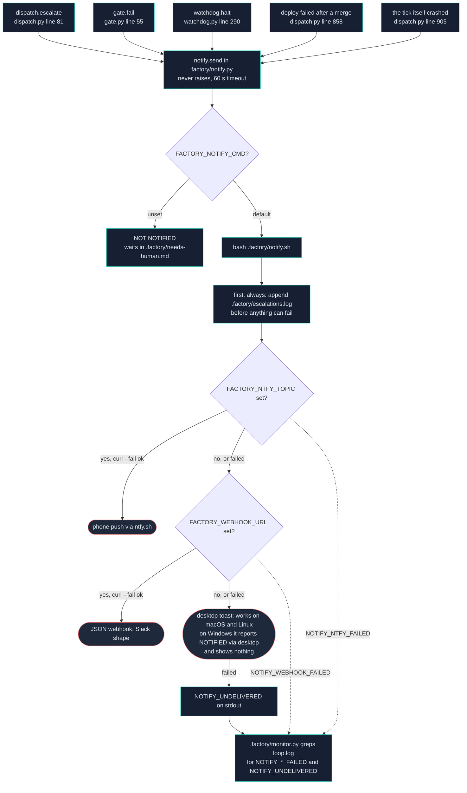
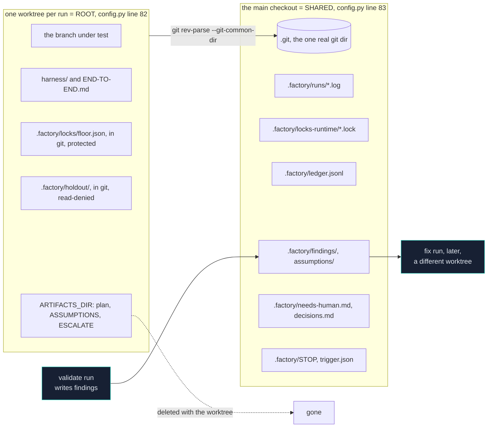

# Key concepts

Every term the factory uses, defined once, with the file that enforces it.

> **Tracks:** `template/factory/state.py`, `config.py`, `guard.py`, `gate.py`,
> `watchdog.py`, `harness/ci.py`, plus `dispatch.py` (locks), `notify.py` and
> `.factory/notify.sh` (the escalation chain), `bin/factory.py` (`level`). Re-read
> after any commit touching those.
>
> **Diagram colours, in every doc here:** teal border = a script or code, a model
> cannot argue past it. Orange border = a model node running a prompt. Red border =
> a human, or a terminal state only a human leaves.

---

## The shape of the thing

**Factory** — a repository that turns its own issues into merged code without a human
reading the diff. Cole also calls it a *dark factory*, after lights-out manufacturing.

**Lap** — one complete pass of work through the factory: issue filed → triaged →
built → judged → merged. Traced end to end in [one-lap.md](one-lap.md).

**Tick** — one run of `factory/dispatch.py`. It reads the state, picks at most one
piece of work, hands it to the engine, and exits. A tick never waits for the work it
started. Default interval: 30 minutes (`INTERVAL_MINUTES`, `config.py`).

**Dial / autonomy level** — an integer 0–5 saying how much runs without you.
Enforced in code at `template/factory/dispatch.py:59` (`REQUIRES_LEVEL`), not in a
document.

| Level | What becomes automatic | Action it unlocks |
|---|---|---|
| 0 | Nothing. Workflows exist; you run them by hand. | — |
| 1 | An accepted issue becomes a branch and a PR | `implement`, `fix` |
| 2 | The validator runs and writes a verdict | `validate` |
| 3 | **It merges.** Nobody reads the diff. | `merge` |
| 4 | It triages its own issues; the weekly regression files its own bugs | `triage` |
| 5 | It writes its own issues from the mission | — |

Level 3 is the destination. A factory that stops at 2 is a code generator with a
queue, and you are still the bottleneck. `factory doctor` refuses to raise the dial
past what the evidence supports.

**Where the dial actually lives.** It is one line of source: `config.py:261`,
`AUTONOMY = _env_int("FACTORY_AUTONOMY", 0)`. `factory level <n>` (`bin/factory.py:589`)
first runs `doctor.py --level n` and dies if it fails, then **rewrites that line with a
regex** (`bin/factory.py:626`) and tells you to commit `factory/config.py`, which is a
protected file, so raising the dial is always a human commit. The environment variable
`FACTORY_AUTONOMY` overrides it for one invocation only, and a level set that way
reverts on the next scheduled tick. There is no level file and no flag on GitHub.

**Target** — one unit of work, named as a string: `gh:issue:12` or `gh:pr:14`. Parsed
by `state.parse_target()`. Every script in the system takes one.

---

## State

**Label as state** — the factory has no database. The `factory:*` labels on a GitHub
issue or PR *are* its state. Labels are visible, editable from a phone, already backed
up, and they are the audit trail (`state.py`, module docstring).

**Transition table** — `template/factory/state.py:88`, `TRANSITIONS`. The one legality
table. Any move not on it is refused with `IllegalTransition`. A node that wants a
forbidden move has misunderstood something, and inventing the transition would bury
the misunderstanding.

**Issue states** (`state.py:60`): `untriaged`, `accepted`, `deferred`, `rejected`,
`in-progress`, `needs-human`, `done`.

**PR states** (`state.py:85`): `open`, `validating`, `passed`, `failed`, `rejected`,
`merged`, `needs-human`, `held`.

The two machines, drawn from `TRANSITIONS` (`state.py:88`). Every state on both
diagrams except `merged` may also move to `needs-human`; those edges are left off so
the rest is readable. `needs-human` has **no** outgoing edge: only a human removes the
label.

One row is shared. `TRANSITIONS` is a single dict keyed by state name, and `rejected`
is both an issue state and a PR state, so a rejected PR carries the issue's row
(`rejected → accepted`), which no PR ever uses. Harmless, and worth knowing before you
read the table and think a PR can become `accepted`.

Three PR states are easy to confuse, and the difference is the whole safety design:

| State | Label | Means | Who moves it out |
|---|---|---|---|
| `failed` | `factory:needs-fix` | A check went red. Under the attempt cap. | The fix workflow, automatically |
| `held` | `factory:held` | Everything is green. The factory made a call it wants agreed with. **Not a failure.** | A human, via `factory accept` |
| `needs-human` | `factory:needs-human` | Stopped. `TRANSITIONS["needs-human"]` is the empty set. | A human, by removing the label |

**`closed-unlabelled`** — a real state, not a bug. GitHub closes an issue itself when
a merged PR says `Closes #N`, a transition the table never authorised. Treated like
`untriaged`: something you arrive in from outside.

**Lock** — a file in `.factory/locks-runtime/`, one per `(action, target)` pair.
Labels are good shared state and a bad mutex: there is no compare-and-swap, so two
readers of `factory:accepted` both claim the issue. The lock is the mutex
(`dispatch.py`, `acquire()`). It is released when the engine reports the run settled,
reaped when its recorded PID is gone plus 5 minutes of grace, or aged out after 180
minutes.

Three ways out, and the order matters: the honest one first, the slow ones as backstop.
`release_settled_locks()` (`dispatch.py:542`) asks Archon for the run id the lock
recorded and releases **only on a provable "finished"**. Every unknown answer keeps
the lock, because the first version guessed, released every lock one tick after taking
it, and then escalated a live lap as dead. `reap_locks()` (`dispatch.py:176`) is the
backstop: PID gone for `LOCK_GRACE_MINUTES` (5, `config.py:291`), or any lock older
than `LOCK_STALE_MINUTES` (180, `config.py:290`).

---

## The checks

**Gate** — the whole validation ladder, and specifically `factory/gate.py`, which
reads the raw run log plus the judge's verdict and decides what happens. When the two
disagree, **the raw output wins** (`gate.py:229` onward).

**Guard** — `factory/guard.py`. Protected paths, the size caps, the file cap. Runs
*before* anything else, so a change that can edit the rulebook is never judged against
the edited rulebook. Exit 2 means "could not compute the diff", which is a failure,
not a pass.

**Rung** — one step of the ladder in `harness/ci.py`. In order: `static` → `unit` →
`app-start` → `e2e` → `holdout` → `mutations`. The ladder stops at the first red rung
and names it (`GATE_FAILED: <rung>`).

**Marker** — a positive string a rung prints to prove it ran. `APP_STARTED`,
`E2E_PASSED journeys=2 steps=9`, `HOLDOUT_PASSED scenarios=2`, `MUTATIONS_CAUGHT=7`,
`PROTECTED_OK`, `GATE_OK`. Named in `config.REQUIRED_MARKERS`, not hardcoded in the
checks — a repo whose harness emits `PLAYTHROUGH_PASSED` sets that instead.

**Empty is not pass** — the design rule behind markers. A check that never ran
produces no failures, and code asking "did anything fail?" reads that as success. So
nothing ever asks that. It asks "did this specific thing report that it ran?"

**Ratchet / floor** — `.factory/locks/floor.json`. A minimum count per marker:
`e2e_journeys`, `holdout_scenarios`, `unit_tests`. The gate asserts observed ≥ floor.
The file is protected, so "delete the check and lower the number in the same commit"
is not available to the factory.

**Slack** — the gap between observed and floor. It is exactly how many assertions
could be deleted with the gate still green. It used to grow whenever the harness
improved, because only a human could raise a protected file — measured on a real
factory, from 7 to 33 in one cycle *because the harness got better*. `merge.py:97`
(`raise_floor`) now closes it on every merge: monotonic, existing keys only, never a
`_MAX` ceiling.

**`UNCALIBRATED_MAX`** — a ceiling, not a floor, in the same file. Check counts may
not fall; the number of margins nobody has chosen a threshold for may not rise. A PR
that introduces a threshold nobody set holds the merge.

**Mutation set** — `harness/mutations/defects.json`. Six to ten deliberate defects
injected into real source on a throwaway copy. Each must make the gate go red. It is
the only thing in the gate that measures your *harness* rather than your *code*. Every
other check asks "is this build good?"; this asks "would this gate know if it were
not?"

**Holdout** — `.factory/holdout/HOLDOUT.md`. Scenarios the builder is blocked from
**reading**, not merely from editing. Everything in `harness/` sits inside the
builder's optimisation loop: it can read those checks and iterate until they are
green, and given enough attempts it will. The holdout is different only because the
builder never sees it. That is the only honest reason to merge code nobody reviewed.

**Independence line** — the boundary the holdout draws. Above it, checks the builder
cannot see. Below it, everything else.

**Tripwire** — `factory/tripwire.py`. Fails loudly if a builder artifact (a plan, an
implementation report) is present in the validator's working directory. It should be
impossible. It is checked anyway, because that failure is silent by construction: the
validator keeps producing confident verdicts and every one is contaminated.

---

## The two kinds of value

The distinction the whole safety argument rests on (`FACTORY_RULES.md` §7.1).

| | Examples | May the factory choose it? |
|---|---|---|
| **Judgement value** — what counts as passing | a floor, a tolerance, a sample size, a deliberate defect, a required marker | **Never.** Choosing one is tuning the judge. |
| **Product value** — what the software does | a price, a rate, a default, a name, a layout | **Yes.** Choose it, record it in `ASSUMPTIONS`, and the merge is held for a human. |

**Assumption** — a product value the plan node chose rather than stopped for. Written
to `$ARTIFACTS_DIR/ASSUMPTIONS` as `NAME=value | WHY: ... CHANGE IF: ...`. It holds
the merge without failing the run. The human then answers a concrete question about a
built, validated thing instead of an abstract one in the dark.

**Escalation** — `factory:needs-human` plus a ledger line plus a notification. All
three, or it is not an escalation (`dispatch.escalate()`). The stop list is
deliberately short: seven items, `FACTORY_RULES.md` §7.2.

**The notification chain** — one function, `notify.send()` in `factory/notify.py`,
called from five places. The docstring's three routes to `needs-human` (the
dispatcher, the gate, the fix-attempt cap) go through two of them:
`dispatch.escalate()` (`dispatch.py:81`, which the fix cap also uses) and `gate.fail()`
(`gate.py:55`). The other three are not escalations of a target at all: a watchdog halt
(`watchdog.py:290`), a deploy that failed **after** a successful merge
(`dispatch.py:858`), and the dispatcher itself crashing (`dispatch.py:905`).
`notify.send()` never raises. It pipes the message on stdin to `FACTORY_NOTIFY_CMD`,
which defaults to `bash .factory/notify.sh` (`config.py:431`), and that script writes
the log **first and unconditionally**, then tries the loudest channel it has.

Three things the picture makes visible.

1. **`curl --fail` is load-bearing**: without it a 4xx from ntfy or Slack exits 0 and
   a rejected message is reported as delivered, a false success inside the alarm.
2. **On Windows the desktop fallback is that false success.** The `*)` branch of
   `.factory/notify.sh:89` runs one PowerShell line that loads the
   `ToastNotificationManager` type and pipes it to `Out-Null`. It never builds a
   notification and never calls `Show()`. PowerShell exits 0, `delivered="desktop"`,
   and the script prints `NOTIFIED via desktop` with nothing on screen. Verified on
   this machine on 2026-09-05: a copy of the script run with no channel variables set
   printed exactly that and exited 0. `monitor.py` cannot see it either, because the
   line it greps for is `NOTIFY_DESKTOP_FAILED`, which never fires. On macOS
   (`osascript`) and Linux (`notify-send`) the same branch does show a notification.
   **On Windows, set `FACTORY_NTFY_TOPIC` or `FACTORY_WEBHOOK_URL` before level 3, and
   run `python factory/notify.py --test` to see something actually arrive.**
3. **The channel variables are read from the environment of whatever runs the tick.**
   `bash .factory/loop.sh` inherits your terminal. A Scheduled Task or cron entry
   installed by `factory arm` does not; set `FACTORY_NTFY_TOPIC` where that process
   can see it (a user environment variable on Windows, the crontab itself on Unix) or
   the armed factory falls through to the desktop branch above.

---

## Memory and safety

**Ledger** — `.factory/ledger.jsonl`. One append-only line per event: `dispatch`,
`settle`, `escalate`. Deliberately dumb, with no analysis in it. It exists because a
tick is stateless by design, and **a process with no memory of its own actions cannot
notice it is repeating itself**. On 2026-09-01 one rejected PR was re-validated 68
times in three and a half hours for $17.18. Every individual tick was correct; the
pathology lived entirely in the sequence, and nothing was writing the sequence down.

**Watchdog** — `factory/watchdog.py`. Reads the ledger and halts the factory when the
history looks pathological. `assess()` at line 140 is a pure function of an event list
and a clock, which is what makes every detector testable with a synthetic history.
Seven detectors — `python factory/watchdog.py --explain` prints this list live:

| Detector | Fires when | Severity |
|---|---|---|
| `repeat-dispatch` | the same (action, target) dispatched ≥3× in 120 min with zero completions, **or** ≥6× regardless | HALT |
| `escalation-ignored` | a target was escalated and then dispatched again | HALT |
| `all-failing` | the last 5 settled runs all ended badly, none completed | HALT |
| `no-progress` | ≥8 dispatches in the window, zero completions | HALT |
| `spend-cap` | ≥$25 in the window | HALT |
| `spend-without-progress` | ≥$8 with nothing completing | HALT |
| `spend-blind` | fewer than half of settled runs carry a cost | WARN |

A HALT writes `.factory/STOP` and notifies. It does not warn and hope — a warning is
what the escalation already was, and the machine drove through it.

One status is deliberately treated as *no evidence* rather than as failure:
`not_found` (`watchdog.py:124`). Archon reports a window of 20 runs and prunes beyond
it, so a busy hour ages runs out routinely. Counting those as failures halted a
healthy factory within an hour of the watchdog going live, while three PRs were
merging.

**Stop button** — two of them, because they fail in different places.
`.factory/STOP` works with the network down. The `factory:stop` label on any open
issue is reachable from a phone. **The remote half fails closed:** any error reading
it counts as stopped.

**`ROOT` vs `SHARED`** (`config.py`) — the distinction that quietly breaks everything
if you get it wrong.

- `ROOT` = the git top level of *this checkout*, which is the worktree when a node
  runs in one. Code under test reads from here.
- `SHARED` = the main checkout, found via `git rev-parse --git-common-dir`. Runtime
  state that must outlive the worktree lives here: `.factory/runs`, the locks, the
  findings, the needs-human ledger, recorded assumptions.

Get it wrong and the fix loop breaks silently: the validator records what it objected
to, the worktree is deleted, and the fix node — a separate run, later — finds nothing.
It does not crash. It re-reads the diff and invents an objection, so every fix attempt
becomes a guess at what the validator wanted.

Rule of thumb from the two boxes: **files the run under test must see stay in the
worktree; records another run must find later go to the main checkout.** `STOP` is
`SHARED` (`config.py:303`) because a stop button that only works inside the worktree
that is already running is not a stop button.

---

## Engine terms

**Archon** — Cole's workflow engine (`github.com/coleam00/archon`). `factory init`
installs it if it is not already present. It runs a YAML workflow as a graph of nodes,
each in a fresh model session, optionally in its own git worktree.

**Node** — one step in a workflow. Two kinds: a `command:` node runs a model against a
markdown prompt; a `script:` node runs Python and returns structured output.

**Workflow** — one YAML file, one job. The pack has five: `factory-triage`,
`factory-implement`, `factory-validate`, `factory-fix`, `factory-regress`.

**Worktree** — a separate git checkout of one branch, created by Archon per run
(`--branch`). `implement`, `fix` and `validate` need one; `triage` runs
`--no-worktree` because it changes no code (`dispatch.py:252`, `NEEDS_WORKTREE`).

**Fresh context** — `context: fresh` on a node. Not a performance choice. A node that
inherits the previous node's context inherits its reasoning, and the independence
argument rests on some nodes not having seen it.

**Model tier** — `small` / `medium` / `large`, not literal model IDs. Archon resolves
a tier against whatever provider is configured, so a factory written in tiers survives
a provider swap. **The tier that runs is the `model:` field in the YAML**, per node or
per workflow: `prime` small, `plan` large, `implement` and `review` medium, `judge`
inherits `factory-validate`'s default of medium, `classify` inherits `factory-triage`'s
default of small. `config.py:130` also defines `MODEL_PLAN`, `MODEL_BUILD`,
`MODEL_JUDGE` and `MODEL_SORT`, but nothing reads them except the `factory status`
printout (`config.py:456`). Setting `FACTORY_MODEL_PLAN=small` changes what `status`
says and nothing else. To change a tier, edit the YAML.

---

## Caps and numbers

| Setting | Default | Why that number |
|---|---|---|
| `SIZE_CAP` | 500 lines of **production** code | Nothing ships that a person could not review even in principle. Tests are exempt: PR #14 was rejected at 515 lines of which 404 were tests — 141 lines of production code, blocked for being well tested. |
| `TOTAL_CAP` | 1500 lines | The backstop, so "put it in `tests/`" is not a way around the cap |
| `FILE_CAP` | 12 files | Catches what a line cap cannot: a six-file change that grows to eleven with five one-line "while I was in here" edits, under the line cap the whole way |
| `MAX_FIX_ATTEMPTS` | 2 | Without a cap a PR ping-pongs until the budget is gone |
| `MAX_PARALLEL` | 1 | Above one, the per-target lock becomes mandatory |
| `ISSUE_CAP_PER_DAY` | 3 per non-owner author | Flood protection. The repository owner is exempt. |
| `INTERVAL_MINUTES` | 30 | Slower than feels right on purpose. A fast loop multiplies the cost of a mistake before anyone notices the mistake. |
| `LOCK_STALE_MINUTES` | 180 | Fallback for when a lock's recorded PID cannot be checked at all |

All of them live in `template/factory/config.py` and every one is overridable from the
environment under the same name with a `FACTORY_` prefix.
