# One lap, traced through the code

One issue, from filed to merged, naming every file that touches it. Read
[key-concepts.md](key-concepts.md) first.

> **Tracks:** `template/factory/dispatch.py`, `state.py`, `gate.py`, `merge.py`,
> `guard.py`, `harness/ci.py`, and all five workflow YAMLs under
> `template/.archon/workflows/factory/`.

---

## The shape, in one picture

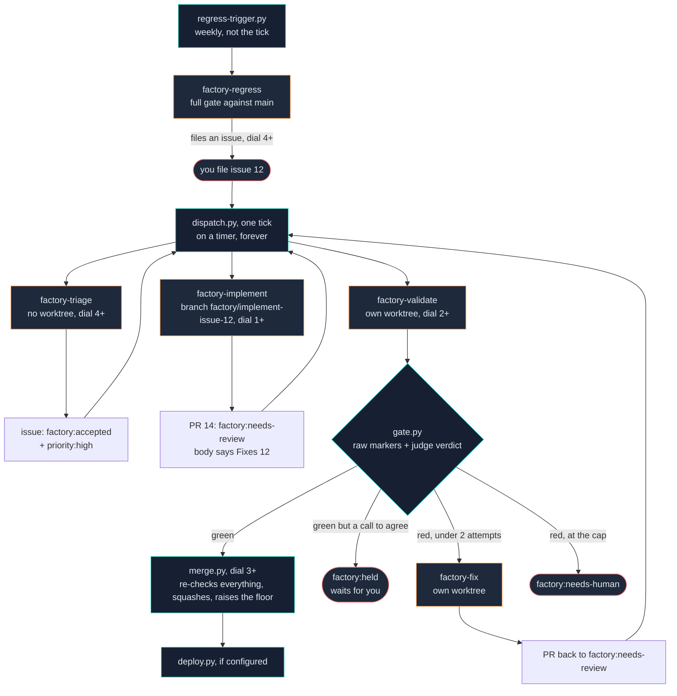

Five workflows (orange). One dispatcher. Two decisions made by code that no model can
argue past (teal): **the gate** and **the merge**. Red is where a person is needed.

---

## Step 0 — The tick

`factory/dispatch.py`, `main()` at line 637. It runs in a fixed order, and the order
is the design.

> **Two cadences, and they differ.** `factory arm` installs a cron / Scheduled Task
> entry at `INTERVAL_MINUTES` (default **30 minutes**). `bash .factory/loop.sh` runs a
> tick every `FACTORY_LOOP_INTERVAL` seconds (default **60**). Both call the same
> `dispatch.py`, and a tick is idempotent and exits fast when there is nothing to do.
> The loop is for watching it work; the schedule is for leaving it alone.

**1. The stop button.** `state.stop_requested()`. Checked first, before anything else
is read. Two signals: the `.factory/STOP` file, and the `factory:stop` label on any
open issue. The remote half fails closed — any error reading it counts as stopped. On
a fresh install with no `origin` remote yet, this fires, and the log says so
explicitly rather than telling you to delete a file that does not exist.

**2. The watchdog.** Reads the last 120 minutes from `.factory/ledger.jsonl`, runs
`watchdog.assess()`, and if any finding is HALT it writes `.factory/STOP` and returns
0. Nothing dispatches this tick. It logs `WATCHDOG_OK events=N findings=0` on a clean
pass — reporting the evidence examined, not just the verdict, because "no findings"
and "the ledger was unreadable so nothing was examined" would otherwise be the same
sentence.

**3. Reconcile.** `release_settled_locks()` then `reap_locks()`. Then a sweep, on
every tick, that is not a dispatch:

- Any PR in `validating` whose lock nobody holds → escalate. A validation died between
  the tripwire and the verdict.
- Any issue in `in-progress` with no PR referencing it → escalate. An implement lap
  died before it opened one.

This runs unconditionally, before the dial check and before the capacity check,
because it does not consume the tick's dispatch budget. Doing it as a case in the
priority order was wrong in a way only running it showed: `next_action` answers with
one thing, so a single untriaged issue at a dial below 4 outranked the stall forever.

**4. The dial.** Below level 1, log what it *would* have run and exit 0.

**5. Concurrency.** If locks held ≥ `MAX_PARALLEL` (1), log and exit.

**6. Ask, dispatch, repeat.** Call `state.next_action(exclude)`, act, add the target
to `exclude`, ask again until the slots run out.

> **The dispatcher consults no model.** A model asked "what work is pending?" invents
> dispatches for issues that were never filed. The dumbest component in the system is
> the one where a wrong answer is worse than no answer.

The six phases as the code runs them. Every early exit is exit 0, on purpose: a tick
that found a reason not to work is a tick that worked.

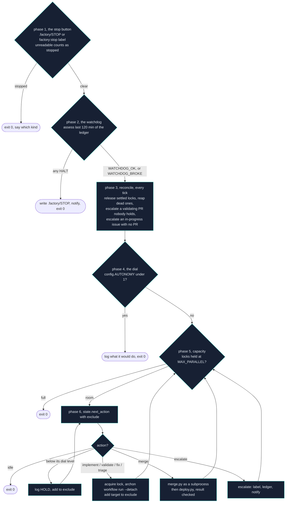

**Nothing pushes.** There is no webhook and there is not meant to be one. An issue
filed at 09:01 waits for the next tick. A push trigger that breaks fails silently and
looks exactly like a factory with nothing to do; a poll that breaks is a poll you can
*see* not running.

---

## Step 0b — The priority order

`state.next_action()`, `state.py:476`. This function is the entire scheduling policy,
and its order is load-bearing: **finish in-flight work before starting new work.**
Reversed, the factory triages forever while its own PRs rot, and throughput looks busy
while going to zero.

| # | Returns | When |
|---|---|---|
| 1 | `fix` | a PR in `failed` under the 2-attempt cap |
| 2 | `escalate` | a PR in `failed` at the cap |
| 3 | `validate` | the **oldest** PR in `open` |
| 4 | `merge` | a PR in `passed` |
| 5 | `implement` | the highest-priority `accepted` issue |
| 6 | `triage` | an `untriaged` issue not rate-limited |
| 7 | `stalled-pr` | a PR stuck in `validating` |
| 8 | `stalled-issue` | an `in-progress` issue with no PR |
| 9 | `idle` | nothing to do |

One filter sits between steps 4 and 5 and is easy to miss: **an issue a live PR
already answers is not work.** `accepted` is reachable while a PR for that issue is
open — a human accepting an issue somebody already built, or an issue walked back from
`in-progress`. Without the filter the dispatcher opens a second branch for the same
issue and both try to merge. It happened: PR #13 was held on ratchet slack, and the
very next tick answered `implement gh:issue:12` — the issue that PR was for. Only a
lock that happened to still be held stopped it, which is luck, not a mechanism.

---

## Step 1 — Triage

**Workflow:** `factory-triage`. Runs `--no-worktree` (it changes no code). Model tier:
`small`. Requires dial ≥ 4.

| Node | Kind | What it does |
|---|---|---|
| `resolve` | script | Parses `gh:issue:12` out of the trigger message. Deterministic, before any model sees anything. `$ARGUMENTS` reaches the script as an environment variable rather than substituted text — that is the injection guard. |
| `flood` | script | `flood-check.py`. Max 3 issues per UTC day per non-owner author. Excess gets `factory:rate-limited`, re-evaluated after midnight. |
| `context` | script | `gather-context.py`. Assembles the issue plus `MISSION.md` and `FACTORY_RULES.md`. |
| `classify` | **command** | The model reads the issue against the mission and emits one disposition. |
| `apply` | script | `apply-triage.py` writes the state through `factory/state.py`. |

> **The model classifies. It does not write state.** A node that could write the state
> directly could write a state the transition table forbids, and then the table is
> decoration.

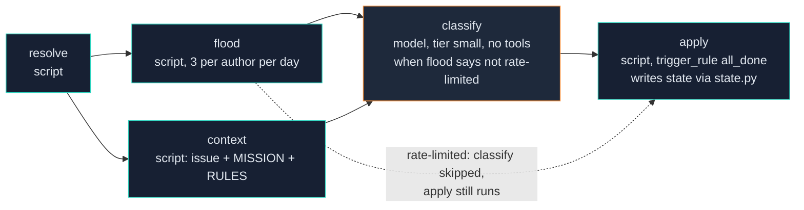

`flood` and `context` run in parallel off `resolve`. `apply` is `trigger_rule:
all_done`, so it runs whether `classify` ran or was skipped, and it is the only node
that touches a label.

Four dispositions, and one distinction is load-bearing: **`deferred` is not
`rejected`.** An issue rejected as out-of-scope is refused forever, including the
quarter it lands on the roadmap. `deferred` means in scope, not now.

The bias rule is narrower than it sounds. *Ambiguous scope* — you cannot tell whether
this is the product's job at all — is a **reject**. *Ambiguous detail* — clearly in
scope, some value unspecified — is an **accept**, with the reading you took written
down. Refusing there is how a queue stops moving while every issue in it is perfectly
buildable.

**Output:** issue #12 now carries `factory:accepted` and `priority:high`.

---

## Step 2 — Implement

**Workflow:** `factory-implement`, in its own worktree on branch
`factory/implement-issue-12`. Requires dial ≥ 1. Eight numbered stages,
twelve nodes (the extras are `resolve`, `gate-plan` and the `stop-escalated` cancel
node).

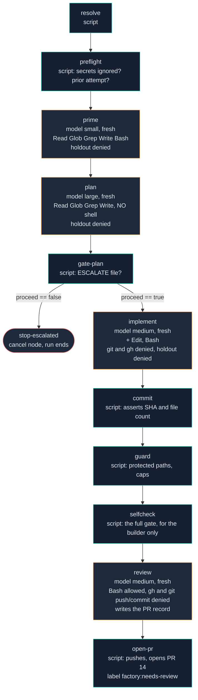

Four model nodes, eight scripts. Every model node is `context: fresh`; every one is
denied the holdout; only `plan` has no shell at all. The tools listed are the grant;
the deny list is what actually restrains them.

### 1. `resolve` + `preflight` (scripts)

`preflight.py` runs everything that must be true before a token is spent, and one
thing that must be true before anything can commit: `git check-ignore` over every
config file that could hold a token. **Empty output means the next run publishes your
key.** It runs as a node that refuses to start, not as a line in a checklist a human
reads.

It also reports `prior_attempt` — whether this branch already carries commits not on
the base. A previous lap may have built most of the feature and then been blocked by
the guard. Those commits are not merged and the issue is not done, but the worktree
looks as though the feature exists, because it does exist, on a branch nobody took.

### 2. `prime` (command, model `small`)

Read-only orientation. Tools: `Read, Glob, Grep, Write, Bash`, with
`.factory/holdout/**` denied for read, glob and grep.

Its purpose is economic: the plan node is the expensive one, and feeding it a cold
read of the repository spends a premium model re-deriving what a cheap one could hand
it.

> **Why the tool grant is coarse and the leash is the deny list.** Proven by probe, in
> both directions: `allowed_tools: ["Bash(python:*)"]` grants **nothing** — the node
> has no shell at all. `allowed_tools: [Bash]` grants a shell.
> `denied_tools: ["Bash(git:*)"]` genuinely blocks it. The first version scoped the
> grant, and the build nodes ran for weeks with no shell: they could not run the quick
> gate, said so politely in prose, and exited 0.

### 3. `plan` (command, model `large`) — the premium slot

**No shell at all.** Tools: `Read, Glob, Grep, Write`. A plan node that can run things
plans to measure something itself, gets refused, and the refusal is silent — the
approval request goes to a human who is not there.

The prompt is `implement/commands/plan.md`, 169 lines, and it is explicitly the
personalisation layer: *"Replace it with your own planning step — the one you actually
read today. What ships here is the shape."*

What it must produce, beyond the plan itself:

- **Out of scope / non-goals.** Unattended, this is the only thing between a two-file
  change and a nine-file one — and the guard's 12-file cap rejects the nine-file
  version outright.
- **An executable validation command per task.** Verbatim, as the implement node will
  type it. Those commands are all it has to go on.
- **A test task.** In the project's own test directory, never `harness/`.
- **An observability task.** If the change introduces a value that moves as a
  consequence of use, exposing it where the harness can see it is *part of this
  change*. A value that moves and is not observable cannot be proven to work by
  anybody — and in a repo that merges without review, that means it cannot be built.
  This is the one hole only a plan can close; the gate will not catch it.

**Its default is to decide, not to stop.** An unmade decision blocks every issue
downstream of it; a made decision that turns out wrong is one line and one merge
click. Product values get chosen and written to `ASSUMPTIONS`. Judgement values never
do. The stop list is five items, and *"an open question in MISSION"* is deliberately
not one of them.

There is a measured reason for that. When the plan node was told to stop for "any open
question", four issues against one product produced four escalations, zero PRs, and
the same unmade decision reported four separate times — because an open question in a
spec was read as "you may not propose" when the author meant "I have not decided". The
more honest the spec, the less the factory could do. One human answer unblocked three
of them.

It also reports a confidence score out of 10 for one-pass success. **Below 6, it
escalates instead** — a plan nobody believes in is cheaper to abandon here than after
three fix attempts.

### 4. `gate-plan` (script) + `stop-escalated` (cancel node)

`gate-plan.py` turns an `ESCALATE` file into a state change and **cancels the run**,
rather than letting five more nodes execute against a plan that says "do not build
this". An explicit escalation file beats a silent no-op.

### 5. `implement` (command, model `medium`)

Tools: `Read, Glob, Grep, Edit, Write, Bash`, with `git` and `gh` denied and the
holdout denied. `idle_timeout: 900000` (15 minutes).

It works the plan task by task, running each task's validation command as it goes.

> **What stops a builder tuning against the gate is not the tool leash.** It is that
> the validator re-runs everything in a separate process, that every deliberate defect
> must still be caught, and that the ratchet refuses a quieter harness.

### 6. `commit` (script)

**Without this the whole lap is theatre.** The implement node edits files in the
worktree, nothing records them, and the worktree is discarded: every node reports OK,
the guard correctly sees two changed files, and the branch ends up empty. Driving the
lap by hand hides this, because a human commits without being told to.

It asserts on the *artifact* — the SHA and the file count — not on the exit code. A
node that was denied a tool exits 0 having changed nothing, and "the run succeeded" is
then true and useless.

### 7. `guard` (script) → `selfcheck` (script) → `review` (command) → `open-pr` (script)

- **`guard`** runs `factory/guard.py` against the branch. Protected paths and the caps,
  before anything else is evaluated.
- **`selfcheck`** runs the full gate for the builder's benefit. Nothing downstream
  trusts it. A lap that opens a PR it already knows is red wastes a whole validation
  cycle to learn that.
- **`review`** is the only node that reads the diff *as code* rather than as markers.
  It writes the PR record; it does not open the PR.
- **`open-pr`** pushes and opens, from the review node's file. Same rule as the merge:
  a node holding `gh pr create` can open a PR against any branch it likes, including
  one nothing validated.

**Output:** PR #14, labelled `factory:needs-review`, body containing `Fixes #12`. That
keyword is not decoration — `state.linked_issue()` extracts it, and a PR without it
cannot be validated at all.

---

## Step 3 — Validate

**Workflow:** `factory-validate`, own worktree. Requires dial ≥ 2. Six nodes.

This is where the independence property lives, and it is enforced in six overlapping
layers because a sentence in a prompt is not enforcement:

| # | Layer | Where |
|---|---|---|
| 1 | Separate run, separate worktree, separate context | Archon `--branch`, `context: fresh` |
| 2 | Narrow fetches — the PR without comments, reviews or commit bodies | `validate/scripts/prepare.py` |
| 3 | Governance read from the **base branch**, before the PR is checked out | `prepare.py` |
| 4 | **No tools on the judge** — `allowed_tools: []` | the YAML |
| 5 | A tripwire that fails loudly if a builder artifact is present anyway | `factory/tripwire.py` |
| 6 | **The gate overrides the judge** when raw output and verdict disagree | `factory/gate.py` |

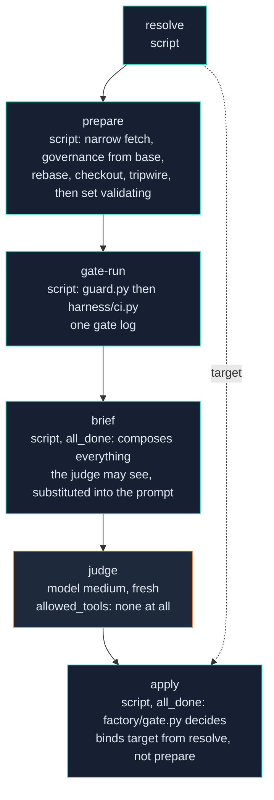

What reaches the judge, and what is kept away from it. The judge has no tools, so
the brief is its entire world:

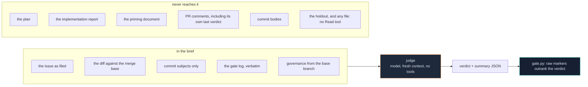

### `prepare` (script)

Fetches narrowly, reads governance from the base first, rebases if the base moved,
checks out the branch, trips the wire, and only then moves the PR to `validating`.
Everything downstream assumes a validation owns it.

### `gate-run` (script)

Runs `factory/guard.py` then `FACTORY_VALIDATE_CMD` (default `python harness/ci.py`)
and writes both into one gate log. `PROTECTED_OK` is a required marker, which is why
the guard writes the first lines of that log.

The guard used here is **this checkout's** guard, run against the branch's tree. A
branch cut before a guard fix would otherwise run the old, broken guard on itself —
the same principle as reading governance from the base, applied to the enforcing code
rather than to the rules it enforces.

The ladder, in `harness/ci.py:190` onward:

| # | Rung | Marker on success | Notes |
|---|---|---|---|
| 1 | `static` | `STATIC_OK` | command from `harness.config.json`; empty → `STATIC_SKIPPED`, loudly |
| 2 | `unit` | `UNIT_PASSED tests=N` | **zero tests is not a pass.** A suite that discovered nothing exits 0 and looks perfect. |
| — | *(`--quick` stops here)* | `GATE_OK mode=quick` | the strict subset the builder may run on itself |
| 3 | `app-start` | `APP_STARTED` | via `appproc.py`, one of three drivers: `http`, `cli`, `library` |
| 4 | `e2e` | `E2E_PASSED journeys=N steps=M` | an agent drives `harness/END-TO-END.md` against the running app |
| 5 | `holdout` | `HOLDOUT_PASSED scenarios=N assertions=M` | absent → `HOLDOUT_ABSENT`, and the log says nothing above the independence line ran |
| 6 | `mutations` | `MUTATIONS_TOTAL / _CAUGHT / _NOT_INJECTED` | skipped inside a mutation build, or 6 defects becomes 36 gate runs |
| — | done | `GATE_OK mode=full` | |

The app is torn down in a `finally` on every path including failure, or a leaked
process holds the port and poisons the next lap.

### `brief` (script) — the most instructive bug in the build

`brief.py` composes everything the judge may see into one document and **substitutes it
into the prompt**.

The judge runs with `allowed_tools: []`. That is the mechanism. The prompt originally
told it to *"read these from `$ARTIFACTS_DIR`"* — files it had no tool to open. It did
exactly the right thing: it refused to fabricate a judgment, said its inputs were
missing, and returned `reject`. Correct behaviour, and a rejected pull request, because
the prompt asked a node to do something the node could not do.

What goes in, and the omissions are the point:

| In | Not in |
|---|---|
| the issue, as filed — the contract | the implementation plan |
| the diff, against the **merge base** | the implementation report |
| the commit **subjects** only | the priming document |
| the gate log, verbatim | any comment on the PR, including the judge's own from a previous round |
| governance from the **base branch** | commit bodies — a commit body is the coder's story |

Truncation is declared, never silent. A diff clipped without saying so is a judge
reasoning about a file it thinks it read to the end.

### `judge` (command, `context: fresh`, `allowed_tools: []`)

One question: *does this diff solve the issue as it was filed?* Not style, not
architecture. Output is a JSON object; only `verdict` and `summary` are required.

> **The schema constrains only what is branched on.** `gate.py` reads exactly one
> field to decide anything: `verdict`. Every enum on a field nobody branches on is a
> fresh chance per finding to fail the whole run over a synonym — eight of them on a
> five-finding review. This node once died five times on
> `error_max_structured_output_retries` and took the run with it.

One YAML gotcha worth stealing: `enum: ["yes", "partially", "no"]` is quoted because
**YAML 1.1 parses bare `yes` and `no` as booleans**. Unquoted, the enum loaded as
`[True, "partially", False]` — a schema demanding a boolean for a field declared
`type: string`. The judge produced something satisfying the contradiction and said
nothing useful: summary "test", one finding "test issue", after two and a half minutes
of real work. Nothing errored anywhere.

**The judge can only ever add a reason to block.** If the markers say red and it thinks
green, either it is wrong or the harness is, and either way that is a human's call.

### `apply` (script) → `factory/gate.py`

`gate.py:229` is the decision. In order:

1. **Precondition.** The PR must be in `validating`. Reaching the gate from another
   state means the independent validation was skipped. Exit 2, `GATE_REFUSED`.
2. **Empty is not pass.** An empty gate log fails outright.
3. **Which rung stopped it.** Reads the last `GATE_FAILED: <rung>` and names it. The
   marker assertions below run in a fixed order, not run order, so without this a
   suite that died early is reported as "APP_STARTED absent" — true, and four steps
   downstream of the cause.
4. **Markers.** Every `REQUIRED_MARKER` must appear. Missing **and** nothing reported
   a failure = the gate did not run, which is a human's problem. Missing **after** a
   named red rung = an ordinary failure, and goes round the fix loop.
5. **Counts against the ratchet.** Observed < floor is a blocker. A floor key with no
   count in the log fails loudly, because a floor nothing measures is a floor nobody is
   held to.
6. **Mutations.** `caught` must equal `total`, and `total` must not be 0. A defect that
   could not be injected (an anchor moved) is a blocker, not a pass — a mutation set
   that silently stops injecting reports a perfect score for doing nothing.
7. **What holds the merge without failing the run:** a rise in `UNCALIBRATED_MAX`, or a
   recorded `ASSUMPTIONS` file. (Ratchet slack used to hold too; `SLACK_CAPS_AUTONOMY`
   now defaults to false — see below.)
8. **The verdict.** Missing or unparseable = fail. **If blockers exist and the judge
   said `approve`, override to `request_changes`** and print `GATE_OVERRIDE`. The
   override is one-way: it can only add a reason to block.

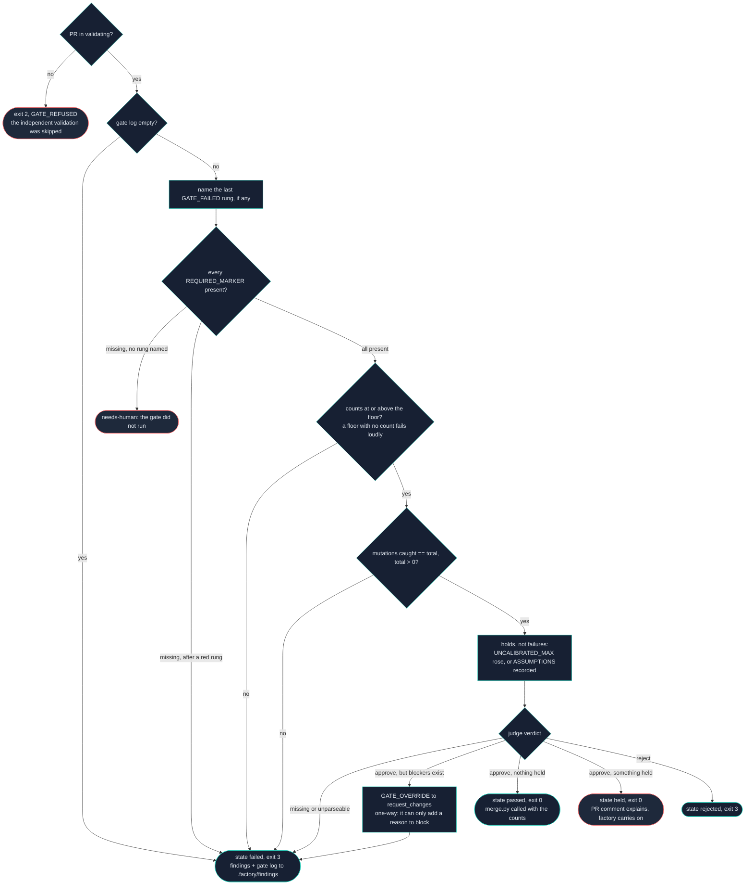

Then one of four endings:

| Verdict | State written | Exit | What happens |
|---|---|---|---|
| approve, nothing held | `passed` | 0 | counts saved, `merge.py` called with them in `FACTORY_OBSERVED_COUNTS` |
| approve, something held | **`held`** | 0 | a PR comment explains the hold; the factory carries on with other work |
| request_changes | `failed` | 3 | findings + gate log written to `.factory/findings/<target>.json` |
| reject | `rejected` | 3 | comment posted |

> **`held`, not `passed`.** The hold used to be a sentence: the gate printed "merge
> HELD", set the PR to `passed`, and the dispatcher merged it forty-five seconds later
> — because `passed` is what a mergeable PR is called, and the dispatcher reads states,
> not prose. The most subtle gate in the system was defeated by the most obvious one,
> and it looked exactly like a clean unattended lap.

Findings are copied to `SHARED`, keyed by target. The fix workflow is a separate
process started later; it cannot name a run directory. A fix node with nothing to read
does not crash — it fixes from memory of the diff, so every attempt is a guess at what
the validator wanted.

---

## Step 4 — Merge

`factory/merge.py:208`. Requires dial ≥ 3. Called two ways: by `gate.py` at the end of
a green validation, or by the dispatcher when it finds a PR already in `passed`.

**It re-checks everything itself.** It does not trust that `gate.py` already did, and
it does not trust the verdict file at all:

1. Target is a PR, state is `passed`, head branch exists.
2. `guard.main()` again, against `origin/BASE..origin/branch`.
3. `git merge-base --is-ancestor base head` — the branch must contain the base, or the
   squash silently drops whatever landed while it was in flight.
4. GitHub's own view, re-read: `state`, `mergeable`, `isDraft`, `baseRefName`,
   `mergeStateStatus`.
5. `gh pr merge --squash`.
6. `raise_floor()` — writes each floor up to the count the gate observed on the tree
   that just landed. Monotonic, existing keys only, never a `_MAX`.

Three exit codes, and the split matters:

| Code | Meaning |
|---|---|
| 0 | merged |
| 1 | refused, needs a human |
| **2** | refused, **already handled** — the branch was behind base, so the PR was requeued to `open` for a fresh validation |

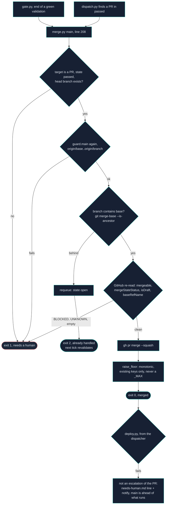

Without the split, the dispatcher escalated every refusal including the one merge.py
had just recovered from. The PR went back to `open` and then straight to
`needs-human` one line later — terminal for nodes. A recovery that undid itself.

Two distinctions worth stealing:

- **`mergeable` and `mergeStateStatus` are different questions.** A PR on a protected
  branch reports `mergeable=MERGEABLE` (no conflict) and `mergeStateStatus=BLOCKED` (a
  required review has not happened). Checking only the first sails past every pre-check
  and fails at the merge with a generic error, which is true and useless.
- **Empty or `UNKNOWN` merge state is not "fine".** GitHub computes it asynchronously.
  Refuse, and let the next tick ask again.

> **Why branch protection does not replace this file.** The tempting move is to delete
> `merge.py` and let a required check plus a ruleset be the gate. It fails in the case
> that matters: the factory authenticates as a principal that administers the
> repository, and an account that can edit a ruleset can bypass one. Branch protection
> is a good second lock and a bad only lock.

After a successful merge the dispatcher runs `factory/deploy.py` and **checks its
result**. A deploy that failed after a successful merge used to be completely silent.
It does not escalate the PR — the merge succeeded and the code is on main; the real
problem is an undeployed main, and marking a merged PR `needs-human` sends a person to
look at something already done.

---

## Step 5 — Fix, if the gate went red

**Workflow:** `factory-fix`, own worktree, four nodes: `resolve` → `prepare` → `fix` →
`land`. Attempt cap: 2.

`prepare-fix.py` reads `.factory/findings/<target>.json`. `land-fix.py` sets the PR
back to state `open` (label `factory:needs-review`), so the next tick hands it to a
fresh validation.

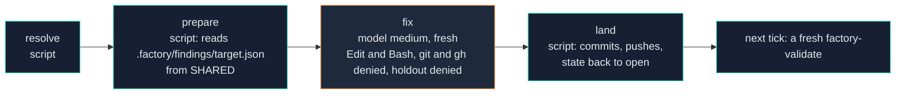

> **A fix is never self-certified.** The node that made the change does not get to
> decide the change worked. This is why `fix` is a separate workflow rather than a loop
> inside `validate`: a fix running in the same process as the judgement it answers can
> inherit the judge's reasoning, and the next validation would be judging a tree built
> with its own previous opinion in context.

At attempt 3, `next_action` returns `escalate` instead.

---

## Step 6 — Regression, weekly

**Workflow:** `factory-regress`. Cron `0 6 * * 1`. Four nodes: `sync` → `suite` →
`diagnose` → `file-issues`.

It is dispatched by `factory/regress-trigger.py`, not by the tick — there is no
`regress` key in `REQUIRES_LEVEL` (`dispatch.py:59`). Folding it into the dispatcher's
priority order would let a busy queue silently starve the one check that looks at main.

**It runs at any dial level. It only FILES issues at level 4 or above.** Below that it
still runs the full gate against main and reports, because an issue queue that fills
itself before anyone has watched a full cycle is a queue nobody trusts.

It runs the full gate against `main` and files an issue for anything broken. That
closes the loop:

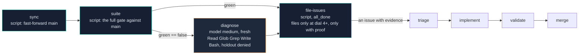

No human anywhere unless all of that fails.

Per-PR validation only ever sees one branch. The failures it cannot see are the ones
needing two merges to appear: two changes individually correct and wrong together, an
assumption one PR made that the next quietly broke, anything showing up only on a cold
start.

**Unlike the validator, this is not bound by the holdout** — it runs against
already-merged code, so there is nothing to hold out from.

**It never files an issue it cannot prove.** If the harness itself failed to run — a
missing dependency, a port collision, an incomplete checkout — it reports that and
files nothing. A factory that spams its own backlog with bogus product bugs when it
cannot prove its own test harness ran is worse than one that stayed quiet.

---

## Where state lives during a lap

| Path | Root | Lifetime | Holds |
|---|---|---|---|
| GitHub labels | — | forever | the state machine, and the audit trail |
| `.factory/locks-runtime/*.lock` | `SHARED` | one dispatch | the per-(action, target) mutex, plus the engine's run id |
| `.factory/runs/*.log` | `SHARED` | until pruned | raw engine output per dispatch |
| `.factory/ledger.jsonl` | `SHARED` | forever, append-only | dispatch / settle / escalate events — what the watchdog reads |
| `.factory/findings/<t>.json` | `SHARED` | until the next validation | what the validator objected to, for the fix node |
| `.factory/findings/<t>.counts.json` | `SHARED` | until merged | observed counts, so a dispatcher-side merge can still raise the floor |
| `.factory/assumptions/<t>.txt` | `SHARED` | until a human clears it | product values the plan chose |
| `.factory/needs-human.md` | `SHARED` | forever | every escalation, appended |
| `.factory/decisions.md` | `SHARED` | forever | answered questions. **A decision is asked once.** |
| `.factory/locks/floor.json` | `ROOT` | in git, protected | the ratchet |
| `.factory/holdout/HOLDOUT.md` | `ROOT` | in git, protected + read-denied | the assertions above the independence line |
| `$ARTIFACTS_DIR/` | worktree | one run | plan, priming, issue, ASSUMPTIONS, ESCALATE, FOLLOWUP |

The `ROOT` / `SHARED` split is the one to get right. See
[key-concepts.md](key-concepts.md#memory-and-safety).

---

## Who talks to whom

The same lap as a conversation between the processes. Two things the prose above
does not make obvious: **GitHub is the only channel between ticks** (no process talks
to another directly; each one writes a label and exits), and **the tick never waits**,
so every hand-off to Archon is a detach, and the answer arrives one or more ticks
later as a label change.

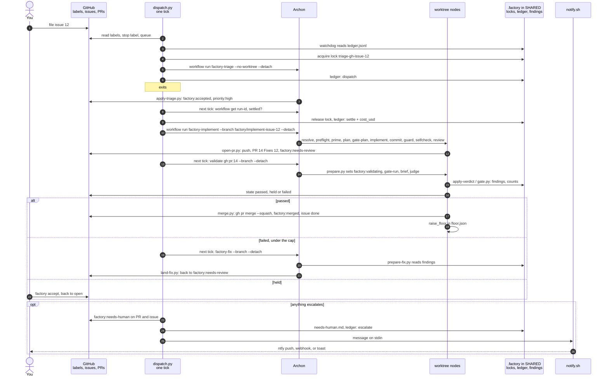

One hazard the diagram hides. Step 2 reads GitHub, and an escalation written seconds
earlier may not be visible yet; GitHub does not promise read-after-write. A validation
was escalated at 19:21:55 and re-dispatched at 19:22:03 from a stale read. The
dispatcher now remembers what **this tick** escalated (`escalated_here`, `dispatch.py`
just after the reconcile sweep) and refuses to dispatch it again, because the transition
table governs moves, not reads.

---

## Running a lap by hand

At level 0, nothing dispatches. Everything still runs:

```bash
factory run implement gh:issue:1
factory run validate gh:pr:2
python factory/state.py next        # what the dispatcher would pick
python factory/dispatch.py --dry-run
python factory/doctor.py
```

Read the plan it wrote, the PR body, and the judge's verdict. Then merge that first PR
yourself, whatever the gate says. You are not testing the merge yet; you are reading
the work.
