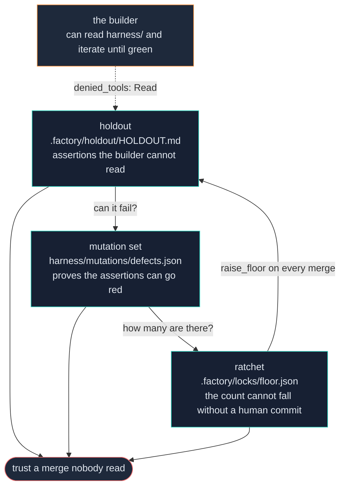

# Study guide

A reading order, things you can run today, and how to follow Cole week to week.

> **Tracks:** the repo as a whole. The "follow along" section tracks `git log`.

---

## The one idea

**The automation is the easy half. Being able to trust a merge nobody read is the hard
half, and most of what is in here exists for that.**

Read every file asking "what would go wrong without this?" — Cole answers that in the
docstring nearly every time, and the answers are the actual curriculum. This is the
rare codebase where the comments are more valuable than the code.

---

## Session 1 — the map (90 minutes, reading only)

| # | Read | Why |
|---|---|---|
| 1 | `README.md` | The pitch, the dial, the command list, what it does not do |
| 2 | [key-concepts.md](key-concepts.md) | Every term, once |
| 3 | `template/FACTORY_RULES.md` (315 lines) | The rulebook. Read §1 triage, §3 gates, §5 protected files, §7 the two kinds of value. |
| 4 | [one-lap.md](one-lap.md) | The trace |
| 5 | `docs/first-hour.md` | What you would actually do after installing |

**Stop and check yourself.** Answer these without looking:

1. Why does a `held` PR exist rather than just a comment saying "merge held"?
2. Why is the holdout read-denied rather than just write-protected?
3. Why does the dispatcher poll instead of using a webhook?
4. What is the difference between a judgement value and a product value?
5. What does exit code 2 mean in `guard.py`, and why is that the safe direction?

Answers are in [key-concepts.md](key-concepts.md) and [one-lap.md](one-lap.md).

---

## Session 2 — the code (three hours, in this order)

Read the docstring first in every case. Cole writes the *why* at the top and the
*what* below it.

| # | File | Lines | What to take from it |
|---|---|---|---|
| 1 | `template/factory/config.py` | 462 | Every knob in the system, on one screen. Note `ROOT` vs `SHARED` and `_base_branch()`. |
| 2 | `template/factory/state.py` | 752 | Read `TRANSITIONS` (line 88) and `next_action()` (line 476). The whole scheduling policy is one function. |
| 3 | `template/factory/dispatch.py` | 906 | Read `main()` (line 637) top to bottom. The order of the six phases is the design. |
| 4 | `template/harness/ci.py` | 348 | Read `main()` (line 190). Six rungs, one marker each. |
| 5 | `template/factory/gate.py` | 682 | Read `main()` (line 229). This is the most consequential 300 lines in the repo. |
| 6 | `template/factory/merge.py` | 453 | Read `main()` (line 208). Note that it re-checks everything. |
| 7 | `template/factory/guard.py` | 279 | Short. Note that it fails closed. |
| 8 | `template/factory/watchdog.py` | 337 | Read `assess()` (line 140). A pure function is why the detectors are testable. |
| 9 | `template/.archon/workflows/factory/implement/factory-implement.yaml` | — | The comments are longer than the config, and they are the point. |
| 10 | `template/.archon/workflows/factory/implement/commands/plan.md` | 169 | The prompt Cole tells you to replace. Read what it is doing first. |
| 11 | `template/.archon/workflows/factory/validate/scripts/brief.py` | 137 | The docstring is the single best bug story in the repo. |

Skim `template/factory/_selftest.py` (1,272 lines) rather than reading it. It ships
done. Know that it exists and that `doctor` runs it every time.

---

## Session 3 — run it

Nothing here needs a real project, a remote, or `gh`. All four are offline, and all
four were run in this clone on 2026-09-04 — the output below is what they printed.

**1. The machinery self-test.** 229 invariants, no network.

```bash
cd template && python factory/_selftest.py
```
```
Every machinery invariant holds.
SELFTEST_PASSED checks=229
```

**2. Mutation-test the self-test.** Proves those checks can actually fail. Takes a few
minutes — it injects each defect into a throwaway copy and requires the self-test to go
red.

```bash
python bin/selfcheck-mutations.py
```
```
SELFCHECK_MUTATIONS_CAUGHT=28 applicable=28
Every applicable defect turns the self-test red.
```

Two defects report `NOT_APPLICABLE` rather than escaping — they change no behaviour, and
the runner says so rather than counting them as caught.

**3. Audit the machinery.** Cross-file invariants no single file can check alone.

```bash
python bin/audit.py
```
```
No findings. The machinery's cross-file invariants hold.
0 failing, 0 warnings
```

**4. Read the watchdog's own thresholds.** The live version of the detector table in
[key-concepts.md](key-concepts.md#memory-and-safety).

```bash
cd template && python factory/watchdog.py --explain
```
```
  repeat-dispatch          one action+target 3x with no completion, or 6x regardless
  escalation-ignored       a target dispatched after being escalated to a human
  all-failing              5 settled runs, none completed
  no-progress              8 dispatches, none completed
  spend-cap                $25.00 in 120m
  spend-without-progress   $8.00 buying nothing
  spend-blind              WARN only: most settled runs carry no cost, so D5 is half-blind
window: 120m
```

**5. Then install it somewhere throwaway.** A small repo with a git remote, `gh`
authenticated, and a test suite that runs.

```bash
cd /path/to/throwaway-repo
python /path/to/ai-software-factory-tutorial/bin/factory.py init
python factory/doctor.py
```

**It will fail. That is it working.** The doctor is a checklist and its failures are
your todo list, each naming the autonomy level it blocks. Do not try to make it green
in one sitting.

Then work `docs/first-hour.md` in order: `MISSION.md` (half an hour, and the half hour
that decides the most) → `harness/END-TO-END.md` → `.factory/holdout/HOLDOUT.md` → the
mutation set → the ratchet → the escalation channel → one lap by hand → the dial, one
notch at a time → `factory arm` → use the stop button once, on purpose.

---

## The four things that are genuinely hard

Everything else ships done. Budget your attention here.

### 1. The out-of-scope list in `MISSION.md`

The section that decides whether any of this works. It is how an agent recognises that
a plausible, well-argued, easy-to-implement request is *drift* rather than a good idea.
Without it, every request is arguably in scope, because almost every feature is
defensible in isolation — and the factory will build all of them.

Sort your non-goals into three piles, because an agent cannot:

- **Never** → `MISSION.md`.
- **Not yet** → the backlog, and it must **not** appear in `MISSION.md`. Anything
  listed out of scope is refused forever, including the quarter it becomes the roadmap.
- **Never, and it is a property rather than a feature** → that is an invariant, and it
  gets its own section.

Aim for at least five, and make them things a reasonable person would genuinely ask
for. "No payments" only earns its keep if somebody would otherwise ask for payments.

### 2. Journeys that assert a value

`harness/END-TO-END.md`. "The page loads" passes against an app that returns an empty
body forever. Name the number: *"Ana is owed exactly 666. She paid 1000 and her own
share was 334."*

Use values that appear nowhere else in the repo. A string the builder can grep is a
string it can special-case.

Describe what the product **does today**, never what it should do. A journey for
behaviour that does not exist yet leaves the gate red before the first lap, and a
permanently red gate means nothing merges — including the change that would make the
journey pass.

> **The reachability constraint is an architecture decision.** The harness reaches
> software three ways: `http`, `cli`, `library`. A rendered window, a game loop, a
> canvas is none of them. The rules have to live behind a headless surface something
> can drive. On a new project that is nearly free to arrange, and a rewrite afterwards.

### 3. A holdout that composes

`.factory/holdout/HOLDOUT.md`. Four rules, and the third earns its keep:

1. Write them **before** the work. A scenario written after seeing the implementation
   is a description of the implementation.
2. Do not reuse a journey. If it is in `END-TO-END.md`, the builder has read it.
3. **Compose.** The dominant real failure is not cheating, it is feature isolation:
   parts individually correct that never work together. Unit tests test features in
   isolation by definition, so what they measure is precisely the thing that is not
   broken.
4. Assert exact figures, not properties. This cost a real escape: a holdout that
   recorded five expenses and asserted "the balances sum to zero" was sailed past by a
   defect that dropped four of them, because one expense's balances sum to zero exactly
   as five do. Work the numbers out by hand.

Verify the deny list in both directions. Watch a node read the file without it, and
fail to read it with it.

### 4. A mutation set spread across rungs

Six to ten deliberate defects in `harness/mutations/defects.json`. Aim one at each
rung, and **read which rung caught each one**.

A set built only from logic defects gets caught entirely by the unit suite, and the
journey, holdout and app-start rungs are never once shown to be able to fail. A perfect
score can mean "the unit suite can fail" and nothing more.

**Aiming is not landing.** Both non-unit defects in Cole's own set landed on the unit
suite the first time: 10/10, four rungs claimed, two of them never demonstrated. A
defect aimed at a rung has to be invisible to every rung above it.

---

## Building your own version

You said "both" — understand it first, then decide. Here is what each path costs.

### Path A — install this template and adapt

The work is entirely in `config.py` plus the three human files, and the prompts if you
want your own process.

| Step | Where |
|---|---|
| Point the harness at your stack | `harness/harness.config.json` — `static`, `unit`, `unit_count_pattern`, `driver` |
| Set the journey agent | `harness.config.json` → `agent.cmd`. It **must** be able to run a shell command; an agent that can only edit files cannot use your app. |
| Rename markers if your harness speaks differently | `config.MARKER_APP_RAN`, `MARKER_E2E`, `REQUIRED_MARKERS` |
| Fill the `<ANGLE BRACKET>` lines | `FACTORY_RULES.md` — `doctor` reports the ones you missed |
| Write the three files | `MISSION.md`, `END-TO-END.md`, `HOLDOUT.md` |
| Replace the planning prompt | `implement/commands/plan.md` — this is your process |
| Add your infrastructure paths | `guard.py:75`, the commented-out `PROTECTED +=` block |

You do **not** touch: `state.py`, `gate.py`, `merge.py`, `guard.py`, `watchdog.py`,
`ledger.py`, `dispatch.py`, `ci.py`. Those are the machinery, and they are on the
protected list precisely so nothing edits them casually.

### Path B — rebuild the ideas on Claude Code

The eight properties in [component-map.md](component-map.md#portability-what-archon-supplies)
are the specification. Reproduce those and everything in `factory/` and `harness/`
comes across unchanged — none of it imports Archon.

The coupling is seven shell-outs to the `archon` binary, listed in
[component-map.md](component-map.md#portability-what-archon-supplies). Replace those
with whatever launches your orchestrated steps, and the state machine, the gate, the
guard, the merge, the ratchet, the watchdog, the ledger and the harness all still work.

The four properties that are genuinely hard to get from skills alone:

1. **Fresh context enforced per step.** A skill you invoke runs in your session, with
   your session's context. Subagents give you this; skills do not.
2. **A deny list the node cannot lift.** `.claude/settings.json` `permissions.deny`, or
   a `PreToolUse` hook. This is what makes the holdout real.
3. **A worktree per run.** You create it, and you must get `ROOT` vs `SHARED` right or
   the fix loop silently breaks.
4. **Detached dispatch plus run status and cost.** Without a cost per run the ledger
   records `cost_usd: null`, the spend detectors go blind, and `spend-blind` fires as a
   permanent warning.

### The one thing to steal regardless of path

The **holdout + mutation set + ratchet** triad. That is the entire trust argument, and
none of it is Archon-specific:

- The holdout says: some assertions are outside the builder's optimisation loop.
- The mutation set says: those assertions can actually fail.
- The ratchet says: the count of them cannot fall without a human commit.

Any one alone is theatre. All three is the reason to merge code nobody read.



---

## Following Cole, week to week

74 commits between 2026-08-31 and 2026-09-02 — this repo moves fast, and the commit
subjects are written as findings rather than as changes ("the import check could not
fail", "three assumptions that break it on a Mac, all on the first tick").

**The remote layout.** `origin` is your own repo. `upstream` is Cole's, and
its push URL is deliberately set to a non-repository so `git push upstream` fails
loudly. Your commits never travel to him.

```bash
git remote -v
# origin    https://github.com/az9713/ai-software-factory-tutorial.git  (fetch/push)
# upstream  https://github.com/coleam00/ai-software-factory.git (fetch)
# upstream  DISABLED_never_push_to_cole                         (push)
```

**Cole publishes no releases and no tags.** One branch, `main`. "His latest" means the
newest commits on `upstream/main`, and there is nothing else to track.

**Two commands do the whole job.** Both are git aliases stored in this repo's
`.git/config`, so they exist here and nowhere else:

```bash
git whatsnew     # fetch, then list his commits you do not have. Changes nothing.
git sync         # fetch, merge his work into yours, push to your repo.
```

`whatsnew` is always safe: it downloads and lists, and touches no file you have.
Run it, read the subjects, then run `sync` when you want the changes.

**To read the detail before taking it:**

```bash
git log -p main..upstream/main -- docs/incidents.md          # the new incidents, in full
git log --stat main..upstream/main -- template/factory/ template/harness/
```

The first is the highest-value command in this repo. Every new incident entry is a new
rule, and it names the mechanism that now enforces it. **Every new incident entry is
a new rule, and it names the mechanism that now enforces it.** Read the incident, then
read the code it points at.

**Which files are volatile, and what a change to each one means:**

| File | Grows when | What a change means for you |
|---|---|---|
| `docs/incidents.md` | every incident | a new failure mode you should check your own version for |
| `template/FACTORY_RULES.md` | a rule is added or narrowed | re-read the section; it is what every workflow reads at run start |
| `template/factory/config.py` | almost every fix | usually a new setting. Diff it against your installed copy. |
| `template/factory/gate.py`, `merge.py` | a hold or a merge path was wrong | the highest-stakes changes in the repo |
| `template/factory/watchdog.py` | a new pathology was seen | a new detector, or a threshold moved |
| `template/.archon/workflows/**` | a node's tools or schema was wrong | the prompts are yours; the node wiring is Cole's |

**If you have already installed it somewhere**, `bin/sync-to.py` pushes template
changes into a repo that ran `init`. Run it with `--dry-run` first — the runner is
copied, never linked, so a fix here reaches nothing already built until you push it.

```bash
python bin/sync-to.py ../your-repo --dry-run
```

---

## Two numbers to carry

**Cost.** One published comparison, on one task: a solo agent produced a
non-functional result in about twenty minutes for single-digit dollars. A planner /
generator / evaluator harness where the evaluator drove the live page produced a
working result in about six hours for roughly twenty times the cost. Twenty times, for
the only version that worked.

Instrument your tokens on day one. Projections for this are wrong by 10–20× in the same
direction every time.

**Failure.** One rejected PR was re-validated 68 times in three and a half hours for
$17.18, and every individual tick was correct. The ledger and the watchdog exist
because of that afternoon. Whatever you build, build the thing that remembers the
sequence.

---

## What a green gate never means

A green gate never means the product is good. It means the layer a machine can check is
intact.

`MISSION.md` has a section for this — *what the factory does NOT own*. Does it **feel**
right (weight, pacing, difficulty, tone)? Does it **look** right (layout, hierarchy,
whether two states read as different)? Is it **understandable** to a first-time user?

Those are reviewed by a person, on purpose, forever. Write them down, or a green gate
will quietly start meaning something it never meant.
